## Insurance Company Template
A simple Insurance Company Java Template for easier insurance management!
> run method `testCode` located on `UserInterface` after any change

## Classes Structure
All classes are located in ./src.
The directory `SearchStructureComparison` contains the time duration of each search structure process.

You can find classes' relations below:
- `InsuranceCompany`: Each company have multiple `Users` 
- `User`: Each user can have `Address` multiple `Policies` (either `ThirdPartyPolicy` or `ComprehensivePolicy`)
- `Address`: Contains city details of users
- `Policy`: Each policy can have a `Car` and expiry date (`MyDate`) 
- `ThirdPartyPolicy`: Inherits all policy features + comments
- `ComprehensivePolicy`: Inherits all policy features + level and driver's age (effective on payment premium)
- `Car`: Each car can have a `CarType`
- `MyDate`: Contains year/month/day
- `Program`: Contains Main method, where everything begins
- `UserInterface`: A simple UI containing menus to work around
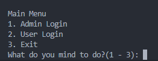
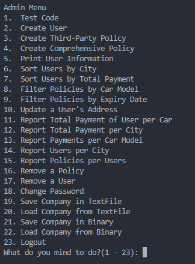
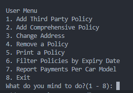

This project uses Swing for GUI Application.
UI Classes:
- `Login`: User and admin login, and the save and load options in the menu actions.
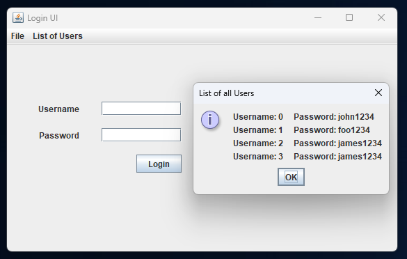
- `AdminUI`: Admin features such as User and Policy management (Search and CRUD). For using User-related actions, `UserUI` is used.
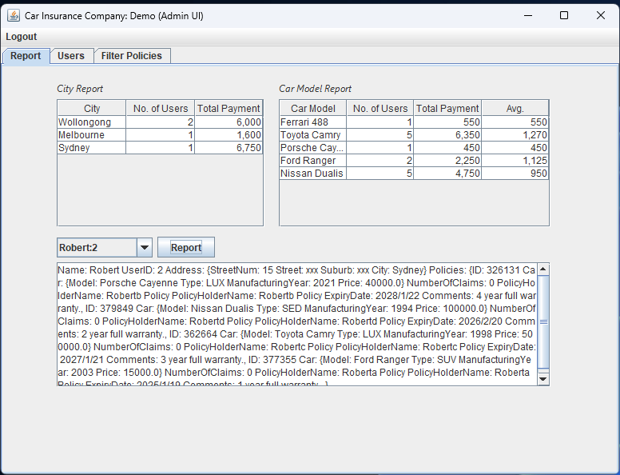
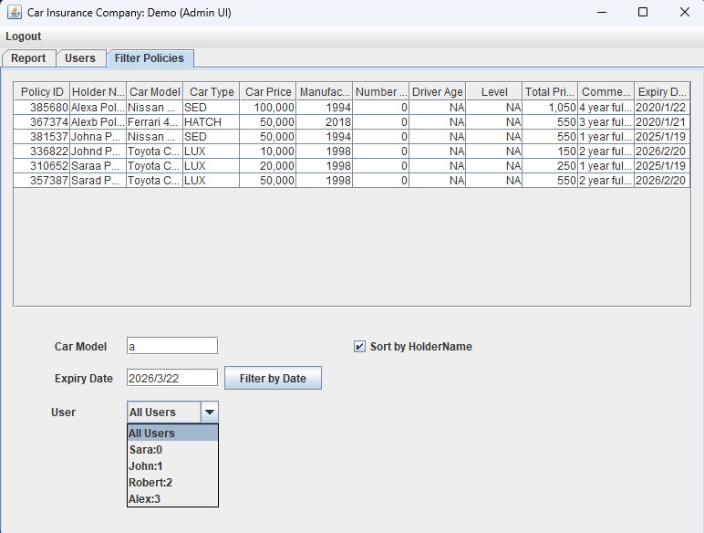
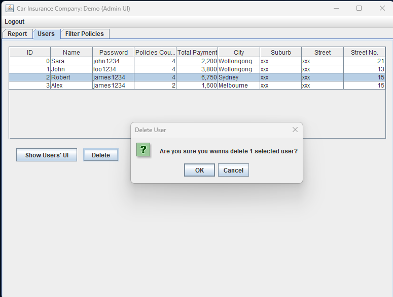
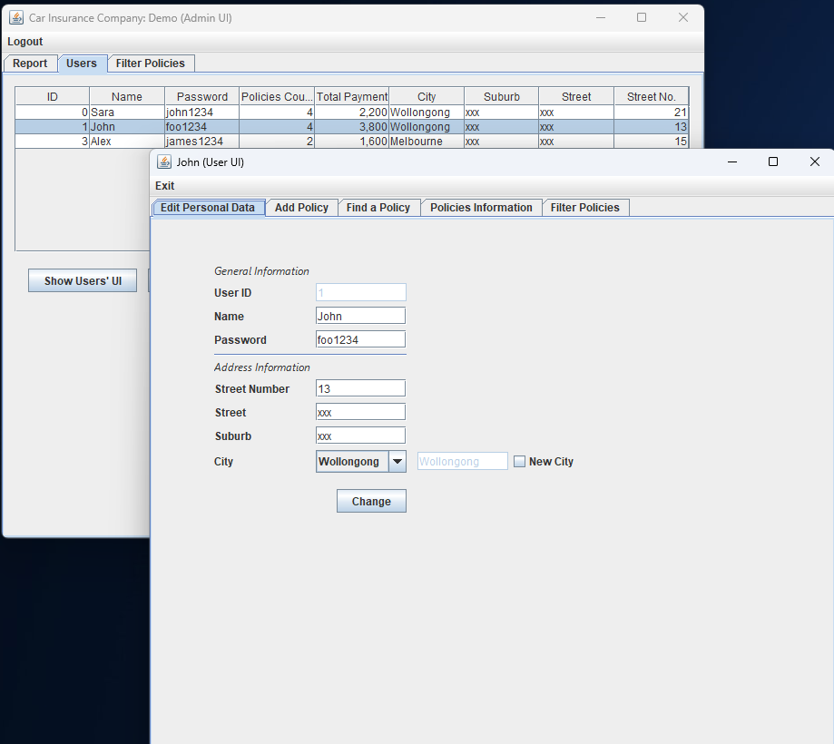
- `UserUI`: User features such as Policy management (Search and Crud). For editing policy, `UpdateUI` is used.
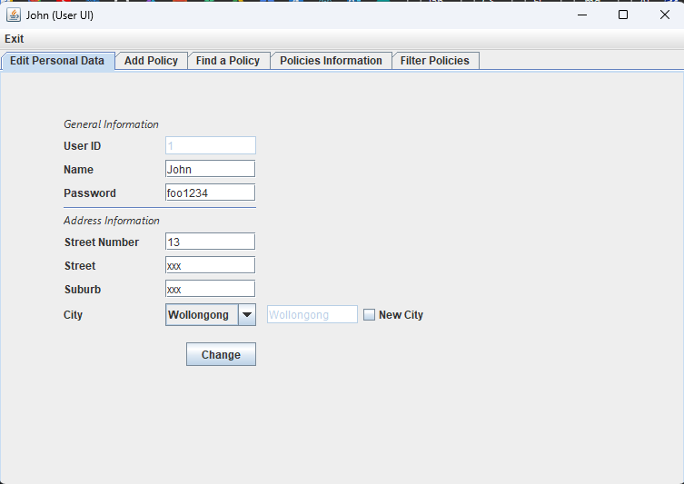
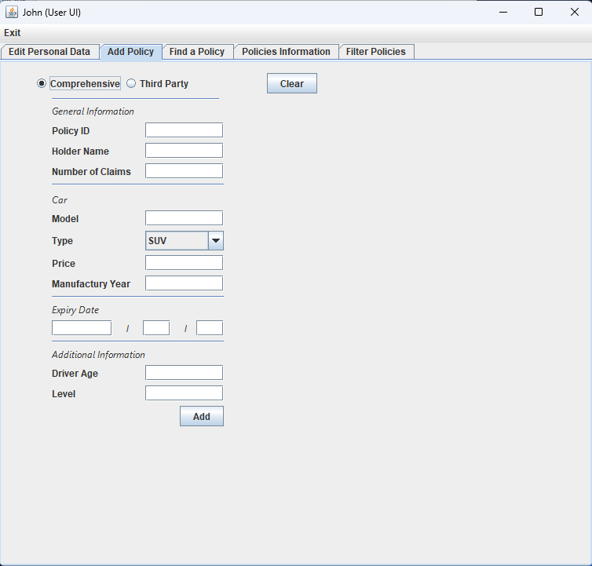
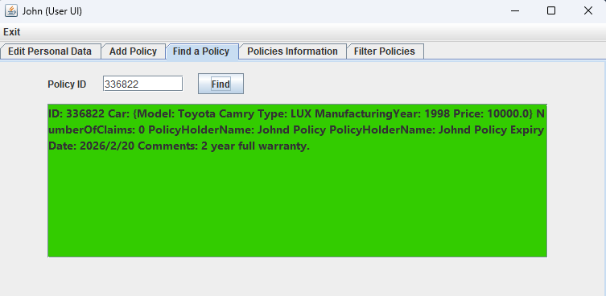
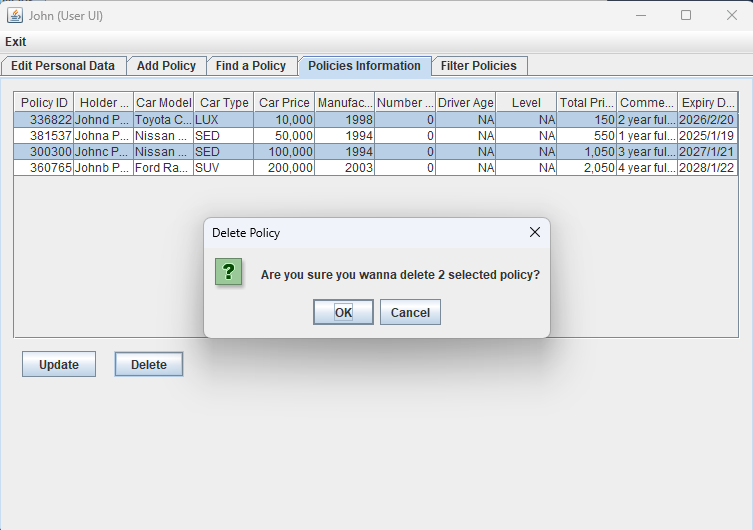
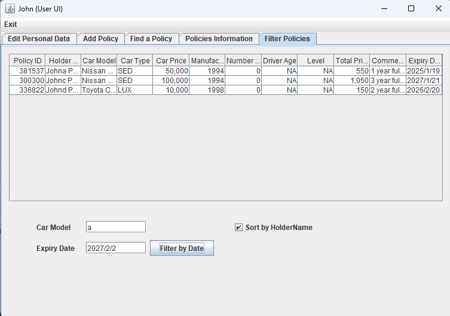
- `UpdateUI`: Used for updating a policy.
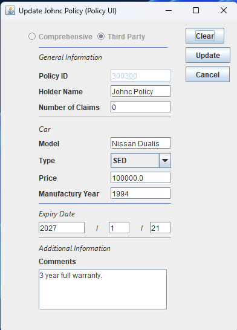

To contribute, you can clone all classes except `UserInterface` and `Program` add your own UI and program. 

## Purpose
This project is written for college assignment.
For an easier track what's done, please view [Github Repository](https://github.com/ceenayekta/car-insurance-company), and view any branch you wish.

## Assignment 1 Completed Levels:
- Core Level
- Standard Level
- Advanced Level

## Assignment 2 Completed Levels:
- Core Level
- Standard Level
- Advanced Level

## Assignment 3 Completed Levels:
- Core Level
- Standard Level
